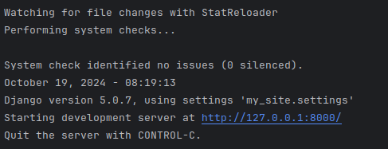
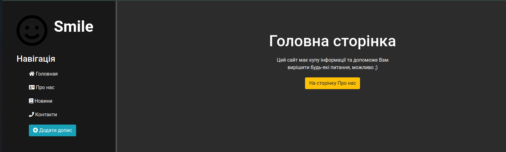

# Web App

## Description
This web application is implemented using Django and provides basic functionality 
for managing articles: adding, editing, deleting, and viewing. It serves as a template 
for personal blogs or small news websites.

Users can publish their own articles and explore others, enabling them to share valuable information.

This project is a basic example for developing applications of this type. While working on it, I learned to:
- **Create** projects using Django;
- **Write** web pages using HTML and CSS;
- **Interact** with the database using Django ORM.


## What I do
I am a platform for posting and reading articles on any topic.

**I can:**
- **Article Creation**: Users can add new entries;
- **Article Editing**: Allows for updating existing entries;
- **Article Deletion**: Provides the ability to delete entries;
- **Article Viewing**: Displays a list of articles and individual details.


What starts to work you need:
- clone repository:
```commandline
git clone https://github.com/NazarKovtun/web_app.git
cd web_app
```
- installing `requirements.txt`:
```commandline
pip install -r 'requirements.txt'
```
- Migrate database:
```commandline
python manage.py migrate
```
- Start server for local used:
```commandline
python manage.py runserver
```



- Clic on http://127.0.0.1:8000 adn you can see a home page:



## What's inside
- `/main` is responsible the main settings application;
- `/my_site` is responsible the home page;
- `/news` is responsible the news page.


## Requirements
- Django 5.0.7
- Python 3.11
